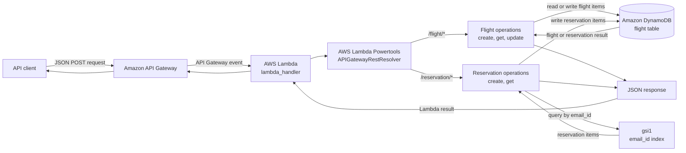
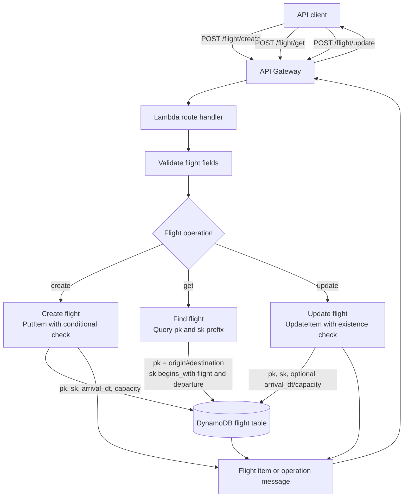
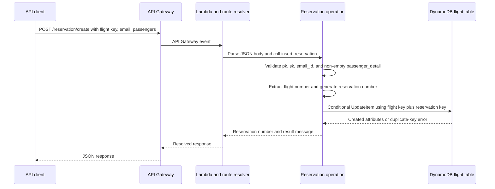
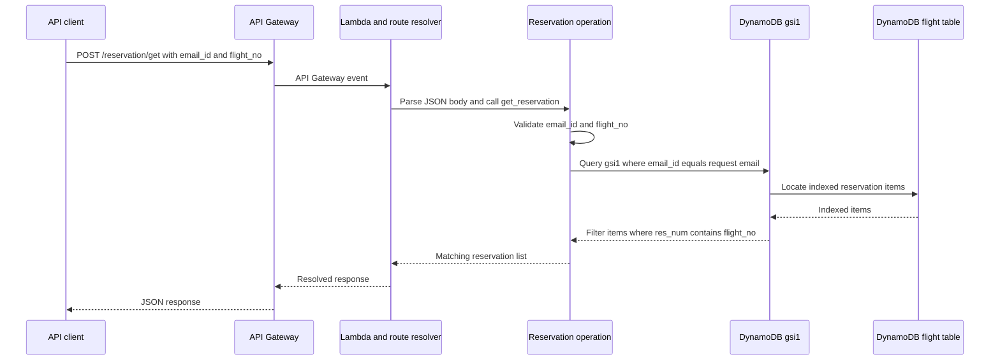
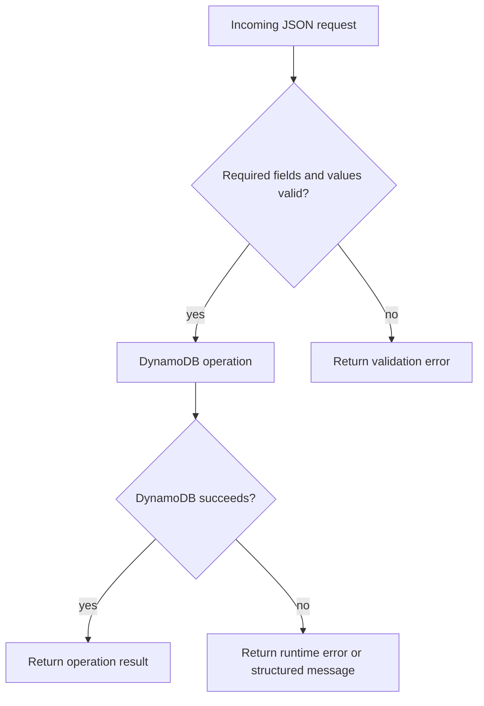

# Flight Service Data-Flow Diagram

## 1. System-Level Data Flow

The service receives JSON requests through API Gateway, resolves routes in the Lambda function, performs validation and business operations, and reads or writes items in DynamoDB. The result travels back through Lambda and API Gateway to the client.



## 2. Flight Data Flow



### Flight key construction

- Partition key: `origin#destination`
- Flight sort-key prefix: `FLIGHT_NO:<flight_no>#DEPARTURE_DT:<departure_dt>`
- Arrival date format: `YYYY-MM-DD HHMMHR`
- Capacity: positive integer

## 3. Reservation Creation Data Flow



The reservation sort key is constructed as:

```text
<flight-sort-key>#RES_NUM:<flight-number>-<six random alphanumeric characters>
```

The reservation item stores `res_num`, `email_id`, `passenger_count`, and `passenger_list` along with `pk` and `sk`.

## 4. Reservation Lookup Data Flow



## 5. DynamoDB Data Relationships

```mermaid
erDiagram
    FLIGHT_ITEM ||--o{ RESERVATION_ITEM : "shares pk"
    FLIGHT_ITEM {
        string pk "origin#destination"
        string sk "FLIGHT_NO and DEPARTURE_DT"
        string arrival_dt
        integer capacity
    }
    RESERVATION_ITEM {
        string pk "flight partition key"
        string sk "flight key plus RES_NUM"
        string res_num
        string email_id
        integer passenger_count
        list passenger_list
    }
    GSI1 {
        string email_id "partition key"
        string indexed_reservation_attributes
    }
    GSI1 ||--o{ RESERVATION_ITEM : indexes
```

## 6. Error Flow



The current implementation does not define a single HTTP status-code or error-body convention. API Gateway or an additional error-handling layer should standardize those responses before production use.
