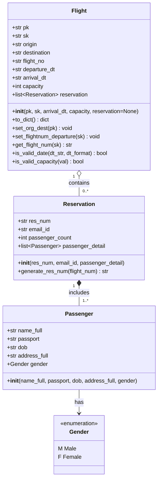
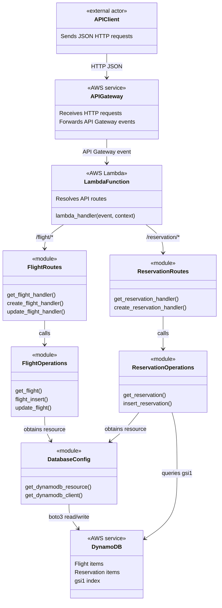
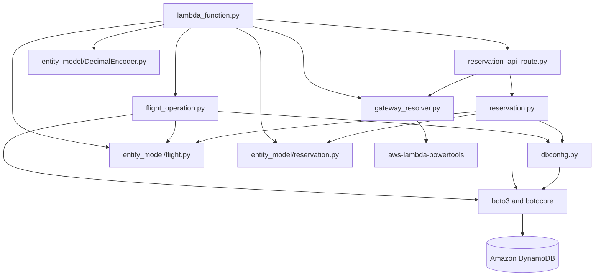

# Flight Service UML Diagrams

## 1. Domain Class Diagram

This diagram reflects the Python domain classes currently defined in the project. The API handlers and DynamoDB operations are shown separately as service components because they are implemented as functions, not classes.

### Domain relationships

- A flight may have zero or more reservations in the domain model.
- A reservation contains one or more passengers according to the service input requirement.
- A passenger has a `Gender` enum value of `Male` or `Female`.
- A flight derives `origin` and `destination` from `pk` and derives `flight_no` and `departure_dt` from `sk`.
- A reservation number is generated from the flight number and six random alphanumeric characters.

## 2. Application Component Diagram

## 3. Module Dependency Diagram

## 4. Main API Operations

| Operation | Route handler | Operation function | Persistence action |
|---|---|---|---|
| Create flight | `create_flight_handler` | `flight_insert` | Conditional DynamoDB write |
| Get flight | `get_flight_handler` | `get_flight` | Query by route and sort-key prefix |
| Update flight | `update_flight_handler` | `update_flight` | Conditional DynamoDB update |
| Create reservation | `create_reservation_handler` | `insert_reservation` | Conditional DynamoDB update using generated reservation key |
| Get reservation | `get_reservation_handler` | `get_reservation` | Query `gsi1` by `email_id`, then filter by flight number |
